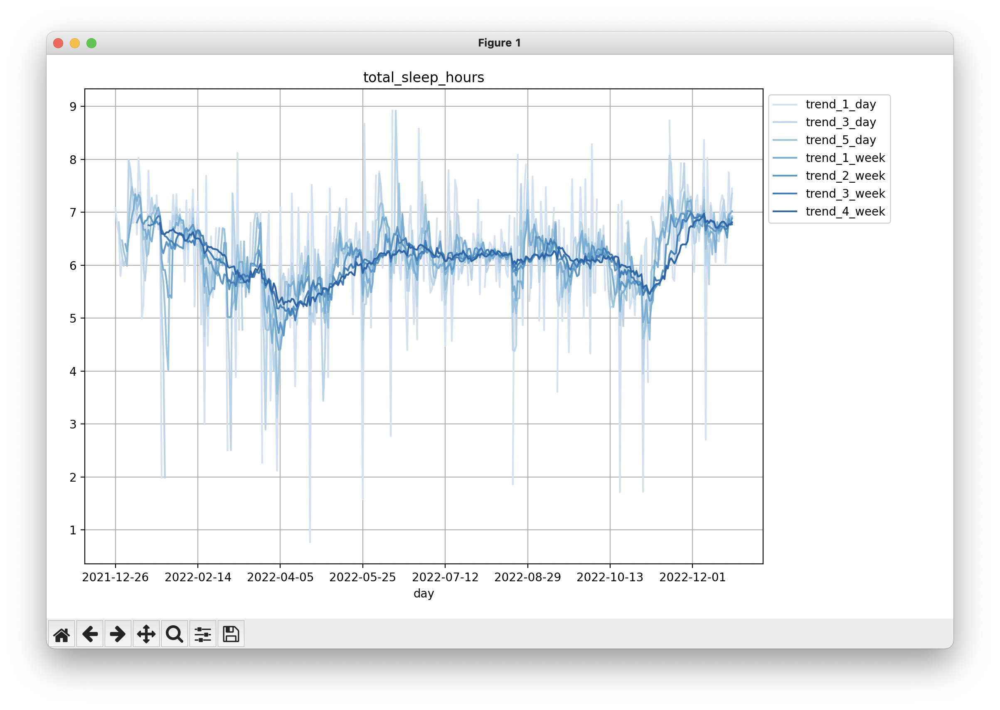

# WHOOP+ <!-- omit in toc -->

Track long term trends in your health using your WHOOP device. Get your first month of WHOOP free at https://join.whoop.com/46A8F8.



## Contents <!-- omit in toc -->

- [Setup](#setup)
- [CLI](#clo)
  - [Using the CLI](#using-the-cli)
- [SQL](#sql)
- [API Requests](#api-requests)
  - [Get Basic Profile](#get-basic-profile)
  - [Get Body Measurements](#get-body-measurements)
  - [Get Cycle Collection](#get-cycle-collection)
  - [Get Recovery Collection](#get-recovery-collection)
  - [Get Sleep Collection](#get-sleep-collection)
  - [Get Workout Collection](#get-workout-collection)

## Setup

Store your WHOOP email and password in a `.env` file:

```bash
# WHOOP credentials
USERNAME="<USERNAME>"
PASSWORD="<PASSWORD>"
```

Install dependencies
```shell
>>>poetry install
```

## CLI

The `WHOOP+` CLI allows you to graph trends across any of the following metrics:
```python
Exertion metrics: [strain,calories]
Heart Rate metrics: [average_heart_rate,max_heart_rate,resting_heart_rate]
Cardiovascular metrics: [respiratory_rate,hrv_rmssd_milli,spo2_percentage]
Temperature metrics: [skin_temp_celsius]
Sleep metrics: [total_in_bed_hours,total_awake_hours,total_sleep_hours,total_no_data_hours,total_light_sleep_hours, total_slow_wave_sleep_hours, total_rem_sleep_hours, sleep_cycle_count]
Sleep Need metrics: [need_from_baseline_hours,need_from_sleep_debt_hours,need_from_recent_strain_hours,need_from_recent_nap_hours]
Sleep Quality metrics: [sleep_performance_percentage,sleep_consistency_percentage,sleep_efficiency_percentage]
```

### Using the CLI
By default, the CLI graphs 6 months of trends. To update this, adjust the DAYS constant in main.py. This will be changed to a CLI input in a future release.

```shell
>>>poetry run python main.py graph_trends  
>>>Metric: [Select a metric from above]
```
### Using the CLI
By default, the CLI graphs 6 months of trends. To update this, adjust the DAYS constant in main.py. This will be changed to a CLI input in a future release.

```shell
>>>poetry run python main.py graph_trends  
>>>Metric: [Select a metric from above]
```

## SQL

`WHOOP+` allows you to query your WHOOP data using SQL. For example:
```sql
SELECT 
    cycle.day
    ,cycle.strain
    ,recovery.resting_heart_rate
FROM cycle
INNER JOIN recovery
    on recovery.cycle_id = cycle.id
```

## API Requests

`WHOOP+` can also make six different types of requests, pulling down Cycle/Recovery/Sleep/Workout collections for the last n days and pulling down your basic profile information. 

### Get Basic Profile

Get your login info

**Example Response**:

```python
{
    "user_id": 26414,
    "email": "ericaleman@mail.com",
    "first_name": "Eric",
    "last_name": "Aleman"
}
```

### Get Body Measurements

Get your body measurements

**Example Response**:

```python
{
    "height_meter": 1.8,
    "weight_kilogram": 85.0,
    "max_heart_rate": 194
}
```

### Get Cycle Collection

Get your last n daily cycles. WHOOP data model available at https://developer.whoop.com/docs/developing/user-data/cycle

**Example Response**:

```python
[
    {
       "id":311600261,
       "user_id":26414,
       "created_at":"2022-12-25T12:34:38.809Z",
       "updated_at":"2022-12-25T12:34:38.809Z",
       "start":"2022-12-25T03:49:58.295Z",
       "end":"None",
       "timezone_offset":"-05:00",
       "score_state":"SCORED",
       "score":{
          "strain":0.051671274,
          "kilojoule":3309.1736,
          "average_heart_rate":63,
          "max_heart_rate":112
       }
    },
    ...
]
```

### Get Recovery Collection

Get your last n daily recoveries. WHOOP data model available at https://developer.whoop.com/docs/developing/user-data/recovery

**Example Response**:

```python
[
    {
       "cycle_id":311600261,
       "sleep_id":571896726,
       "user_id":26414,
       "created_at":"2022-12-25T12:34:38.809Z",
       "updated_at":"2022-12-25T12:34:40.534Z",
       "score_state":"SCORED",
       "score":{
          "user_calibrating":false,
          "recovery_score":89.0,
          "resting_heart_rate":64.0,
          "hrv_rmssd_milli":47.77199,
          "spo2_percentage":96.2,
          "skin_temp_celsius":32.9
       }
    },
    ...
]
```

### Get Sleep Collection

Get your last n daily sleep cyles. WHOOP data model available at https://developer.whoop.com/docs/developing/user-data/sleep

**Example Response**:

```python
[
    {
       "id":571896726,
       "user_id":26414,
       "created_at":"2022-12-25T12:34:38.809Z",
       "updated_at":"2022-12-25T12:34:40.534Z",
       "start":"2022-12-25T03:49:58.295Z",
       "end":"2022-12-25T12:23:47.732Z",
       "timezone_offset":"-05:00",
       "nap":false,
       "score_state":"SCORED",
       "score":{
          "stage_summary":{
             "total_in_bed_time_milli":30597761,
             "total_awake_time_milli":3770913,
             "total_no_data_time_milli":0,
             "total_light_sleep_time_milli":15362166,
             "total_slow_wave_sleep_time_milli":4100720,
             "total_rem_sleep_time_milli":7363962,
             "sleep_cycle_count":5,
             "disturbance_count":21
          },
          "sleep_needed":{
             "baseline_milli":27504534,
             "need_from_sleep_debt_milli":3182667,
             "need_from_recent_strain_milli":191236,
             "need_from_recent_nap_milli":0
          },
          "respiratory_rate":14.238281,
          "sleep_performance_percentage":87.0,
          "sleep_consistency_percentage":85.0,
          "sleep_efficiency_percentage":87.67585
       }
    },
    ...
]
```

### Get Workout Collection

Get your last n daily sleep cyles. WHOOP data model available at https://developer.whoop.com/docs/developing/user-data/workout

**Example Response**:

```python
[
    {
       "id":84653809,
       "user_id":26414,
       "created_at":"2020-06-26T00:05:00.505Z",
       "updated_at":"2020-06-26T00:11:08.624Z",
       "start":"2020-06-25T23:35:22.629Z",
       "end":"2020-06-26T00:04:54.192Z",
       "timezone_offset":"-04:00",
       "sport_id":0,
       "score_state":"SCORED",
       "score":{
          "strain":9.3621,
          "average_heart_rate":139,
          "max_heart_rate":171,
          "kilojoule":1303.4093,
          "percent_recorded":100.0,
          "distance_meter":3306.1038,
          "altitude_gain_meter":34.923603,
          "altitude_change_meter":0.088306166,
          "zone_duration":{
             "zone_zero_milli":0,
             "zone_one_milli":160999,
             "zone_two_milli":431999,
             "zone_three_milli":600999,
             "zone_four_milli":577996,
             "zone_five_milli":0
          }
       }
    },
    ...
]
```